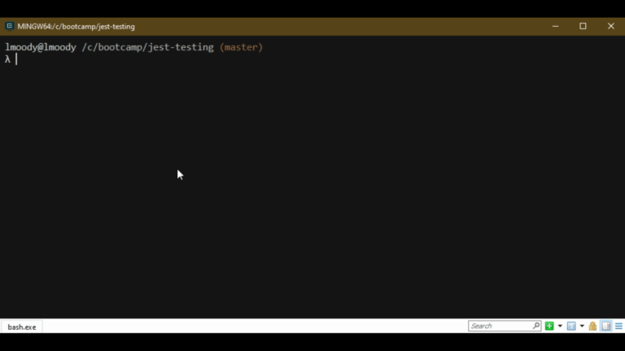

# jest-testing
Node cli app that uses inquirer to generate a team profile and utilizes jest for testing.

## installation
This application uses 2 npm packages [inquirer](https://www.npmjs.com/package/inquirer) and [jest](https://www.npmjs.com/package/jest). After downloading the project please run `npm i` or `npm install` to download these dependancies.

## usage
This application is meant for a project manager to create a snapshot of their team for a specific project. It allows the manager to fill out their own details as well as the details for any number of engineers/interns who are on their team.

Inquirer will ask unique questions for each employee type. Office phone for the project manager, github username for the engineer(s) and school for the intern(s).

Here is a snapshot of the sample html template that was generated through the application.

